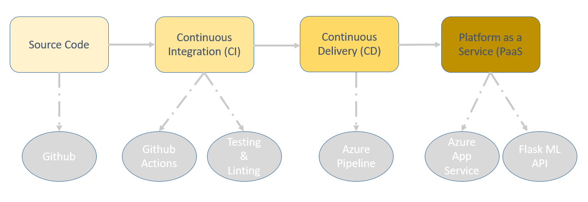
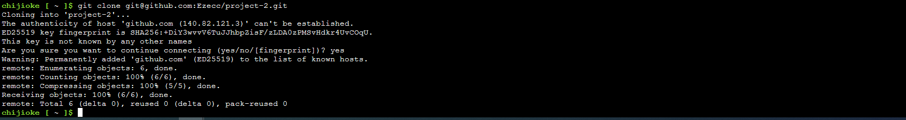
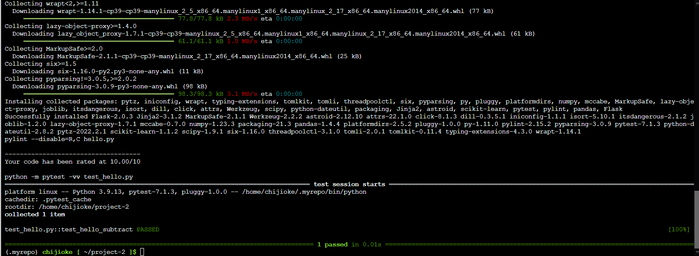
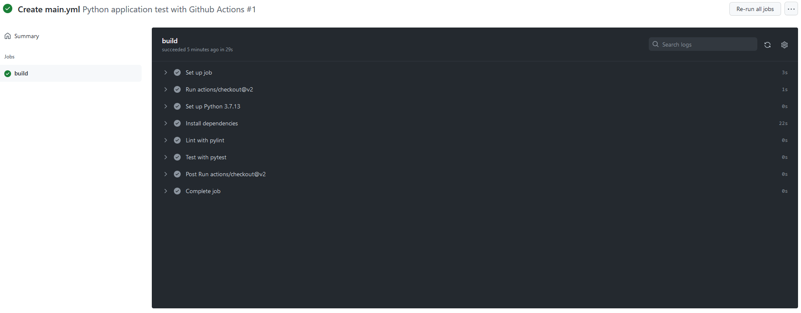

# Building a CI/CD Pipeline
## Overview
This project involves building a Github repository from scratch and creating a scaffolding that will be used to perform both Continuous Integration and Continuous Delivery for a Python-based machine learning application using the Flask web framework. It requires the use of Github Actions along with a Makefile, requirements.txt and application code to perform an initial lint, test, and install cycle. Further, the project is integrated with Azure Pipelines to enable Continuous Delivery to Azure App Service.

[](https://github.com/Ezecc/project-2/actions/workflows/main.yml)

## Project Plan
Below  are the links to Trello board and spreadsheet for the project.
- [Project Trello Board](https://docs.google.com/spreadsheets/d/1-Hxu01ULV00NyDzv8BaUDq6MxsHrYBUAaKTyO5BVbls/edit?usp=sharing)

- [Initial project spreadsheet](https://docs.google.com/spreadsheets/d/1xqKjiT4MKB6uVOlxOQu0apmq0jOis8eYk-xK6Vg5MwY/edit?usp=sharing)

- [Final Project Spreadsheet](https://docs.google.com/spreadsheets/d/1-Hxu01ULV00NyDzv8BaUDq6MxsHrYBUAaKTyO5BVbls/edit?usp=sharing)


## Instructions

### Project Architecture
Below is the architectural diag the project.


### Creating the project repository
Setup the project repository on Github with the initial project scaffold: 
- Makefile
- Tests
- code
- requirements.txt

### Creating Azure Cloud Development Environment
- Launch an Azure Cloud Development Shell Development Environment
- create ssh-keys
- upload public ssh key to the github account hosting the project repository

### Cloning the project into Azure Cloud Shell
Below is the screenshot of the project repo cloned into the azure shell development environment.



### Updating the project scaffold and creating Python virtual environment
- Update the project files: `Makefile`, `requirements.txt` and include the project code files
- Create a Python virtual environment
- Create the project sript file and test files

### Performing local code test
- Test the code by running ```make all```
- A screenshot showing passing the test is shown below:



### Configure and Test GitHub Actions
Go to the Github repo and do the following:
- Enable Github Actions in the project
- Replace ```yml``` code autogenerated by enabling Github Actions with the provided ```yml```  code 
- Verify remote tests pass in Github Actions UI
as shown below:




### Continuous Delivery on Azure
Configure Azure Pipelines to deploy the Flask starter code to Azure App Services as follows.
- Replace scaffolding code with Flask ML code
- Authorize Aure App Service
- Enable condinuous deployment with Azure Piplines
- Checkin Azure Pipelines ```yml``` config file into Github
- Enable Github + Azure Pipelines
- Deploy the project
- Modify the starter code file ```make_predict_azure_app.sh```  with your chosen app name
- Verify prediction by running the code ```make_predict_azure_app.sh```

### Enhancements (Future Improvement Suggestions)

Some of the ways the project can be improved in the future are:
- Ensure that all needed packages are specified in the ```requirements.txt``` file.
- Provide starter codes for deep learming frameworks such as Pytorch and TensorFlow.


<TODO:  Instructions for running the Python project.  How could a user with no context run this project without asking you for any help.  Include screenshots with explicit steps to create that work. Be sure to at least include the following screenshots:

* Project running on Azure App Service

* Project cloned into Azure Cloud Shell

* Passing tests that are displayed after running the `make all` command from the `Makefile`

* Output of a test run

* Successful deploy of the project in Azure Pipelines.  [Note the official documentation should be referred to and double checked as you setup CI/CD](https://docs.microsoft.com/en-us/azure/devops/pipelines/ecosystems/python-webapp?view=azure-devops).

* Running Azure App Service from Azure Pipelines automatic deployment

* Successful prediction from deployed flask app in Azure Cloud Shell.  [Use this file as a template for the deployed prediction](https://github.com/udacity/nd082-Azure-Cloud-DevOps-Starter-Code/blob/master/C2-AgileDevelopmentwithAzure/project/starter_files/flask-sklearn/make_predict_azure_app.sh).
The output should look similar to this:

```bash
udacity@Azure:~$ ./make_predict_azure_app.sh
Port: 443
{"prediction":[20.35373177134412]}
```

* Output of streamed log files from deployed application

> 

## Enhancements

<TODO: A short description of how to improve the project in the future>

## Demo 

<TODO: Add link Screencast on YouTube>


